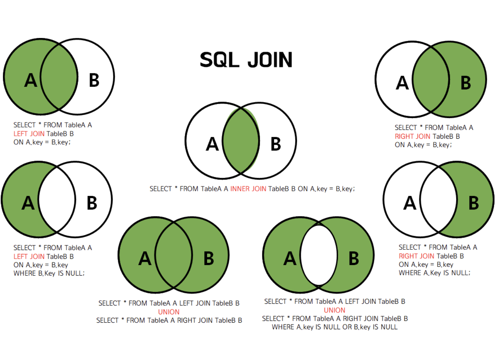

## 관계형 데이터 모델
- 관계형 데이터베이스의 기반이 되는 데이터 모델로 가장 널리 사용되고 있음.
- 표(테이블)을 이용하여, 데이터를 정의하고 설명한 모델

## 릴레이션(relation)의 구성?

- 속성(attribute)(=field, column) : 릴레이션을 구성하는 각 열의 이름
ex. 주소록 릴레이션을 구성하는 속성- 이름,전화번호,주소,생일
- 튜플(tuple)(=record,row) : 릴레이션의 각 행
ex. 주소록 릴레이션의 한 튜플 : '홍길동', '010-1234-5678','서울','1월1일' 

## 데이터베이스 키란?
- 데이터베이스에서 조건에 만족하는 튜플을 찾거나,순서대로 정렬할때 기준이 되는 속성을 말함.
- 필드들의 일부로, 각 레코드들을 유일하게 식별해낼 수 있느 식별자 역할을 함.
- 일반적으로 하나의 필드를 키로 지정하나, 여러개의 필드들로 키를 구성할 수도 있음.
 ->두 개 이상의 필드들로 구성된 키를 복합키(composite key)라고 함.

## 데이터베스 키의 종류?
- 슈퍼키(Super key) : 한 릴레이션 내에 있는 속성들의 집합으로 구성된 키. 유일성은 만족하지만 최소성은 만족하지 못한다.
- 후보키(Candidate key) : 속성들 중에서 튜플을 유일하게 식별하기 위해 사용되는 속성들의 부분집합. 기본키로 사용할수 있는 속성들을 말함.
(유일성-하나의 키 값으로 하나의 튜플만을 유일하게 식별할 수 있어야함. 최소성-키를 구성하는 속성 하나를 제거하면 유일하게 식별할 수 없도록 꼭 필요한 최소의 속성으로 구성돼야 함.)
- 기본키(Primary key) : 후보키 중에서 특별히 선정된 키이며, 특정 튜플을 유일하게 구별할 수 있는 속성. 중복된 값을 가질 수 없으면 null값을 가질 수 없다. 
- 대체키(Alternate key) : 후보키가 둘 이상일떄, 기본키를 제외한 나머지 후보키.
- 외래키(Foreign key) : 다른 릴레이션의 기본키를 참조하는 속성, 또는 속성들의 집합.

## join(my sql)
두 개 이상의 테이블을 묶어서 하나의 결과 집합으로 만들어 내는 것. 즉, 서로다른 테이블에서 데이터를 가져올때 사용하는 방법.

1)Inner join(내부조인)

2)Outer join(외부조인)

3)Cross join(상호조인)

4)Self join(자체조인)

5)left join

## 데이터베이스 정규화(Normalization)?
테이블 간에 중복된 데이터를 허용하지 않는다는 것이다. 무결성을 유지할 수 있으며, db저장 용량을 줄일 수 있음.

## 정규화 절차

- 제1정규화 : 테이블의 컬럼이 하나의 값을 갖도록 테이블을 분해하는 것
- 제2정규화 : 제1정규화를 진행한 테이블에 대해, 기본키의 부분집합이 결정자가 될 수 없도록 테이블을 분해하는 것을 말함.
- 제3정규화 : 제2정규화를 진행한 테이블에 대해 이행정 종속을 없애도록 테이블을 분해하는 것.
a->b, b->c => a->c가 되지 않도록 하는 것
- BCNF 정규화 : 제3정규화를 진행한 테이블에 대해 모든 결정자가 후보키가 되도록 테이블을 분해하는 것.

## 데이터베이스 반정규화?
정규화는 데이터 조회(select)시에 조인을 유발하기 때문에 cpu와 메모리를 많이 사용한다. 반정규화는 조인으로 인하여 성능이 저하되는 문제를 해결할 수 있다.
반정규화는 데이터 중복을 허용하고, 조인을 줄이는 데이터베이스 성능향상 방법이다.
반정규화는 select 속도를 향상시키지만, 모델의 유연성은 낮아진다.

## 반정규화의 절차?
- 대상조사 및 검토 : 데이터 처리범위, 통계성 등을 확인해서 반정규화 대상을 조사한다.
- 다른방법 검토 : 반정규화를 수행하기 전에 다른 방법(클러스터링, 뷰, 인덱스 튜닝, 응용프로그램, 파티션)이 있는지 검토한다.
- 반정규화 수행 : 테이블, 속성, 관계 등을 반정규화한다.

->데이터 무결성이 깨질 수 있는 위험을 무릅쓰고 데이터를 중복하여 성능향상을 노림.

